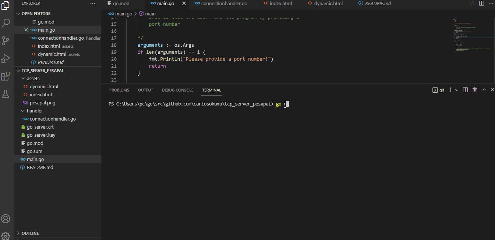

# Solution to  Junior  Developer role -Http server

Writing an Http Server  in Golang.
The server serves like below:

**Background**

     Design a basic HTTP web-server application which can listen on a configurable TCP port and serve both static HTML and 
     dynamically generated HTML by means of a chosen programming language, such as in the way Apache uses PHP. 
     It is acceptable for this server application to support only a restricted subset of HTTP, such as GET or POST requests, 
     and the only headers it must support are Content-Type and Content-Length.
